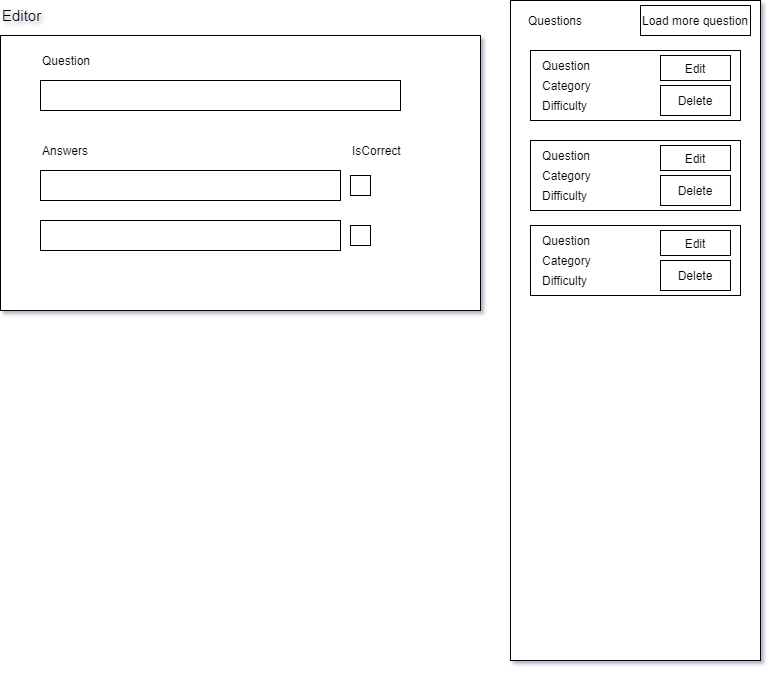

# buff-quiz-test

React Redux Typescript Simple Quiz Dashboard for SportBuff company test

### BuffUp React coding challenge

### Requirements:

- Use React version 16+ / Typescript 3.8+
- Create Unit test for at least one component
- Your solution should be stored in a public github repository and the URL should sent by email to us

### About the task:

Our aim to create a Dashboard for a Quiz game based on https://opentdb.com/ API.

- Load 10 Sport questions using the following Opentdb API endpoint `https://opentdb.com/api.php?amount=10&category=21&difficulty=medium&type=multiple`

- Use the following UI sketch to create an interface for Editing / Deleting and Listing Questions:

  

- Add a Button for loading more questions from the API and merge them into the existing list (newer questions first).

##### To help you save some time with the Tech Task, we have provided you with a skeleton code that you should use to base your solution up.

### React specific requirements / bonus:

- Use state management (Redux, React Context)
- Use some popular UI library (eg.: MATERIAL-UI)
- Use form validation with the following rules:
  ```
  - At least one answer must be correct
  - At least one answer must be incorrect
  - Answers can't be an empty string
  - The question can't be an empty string
  ```
- Try to avoid using `any` or `unknown` as types or parameters.
- Bonus: Add support for adding / removing answers (2,3,4,5 possible answers)
- 2nd Bonus: Add a preview option for the Questions Editor
